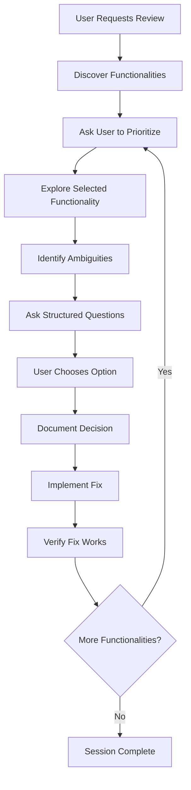

# Interactive Architecture Agent

> An intelligent agent that resolves code architecture ambiguities through interactive questioning instead of making assumptions

[](.) [](LICENSE) [](.)

## 🎯 Problem Solved

Traditional AI coding agents fail because they:
- Make assumptions without asking clarifying questions
- Lack context about your codebase conventions  
- Try to solve everything at once instead of incrementally
- Over-engineer without understanding MVP vs production needs
- Don't learn project patterns across sessions

## 🚀 Solution: Question-First, Code-Later

This plugin implements a **Clarifying Architect** system that:

✅ **Never makes assumptions** - Always asks before deciding  
✅ **Explores incrementally** - One functionality at a time  
✅ **Presents options with trade-offs** - You choose the approach  
✅ **Learns your conventions** - Documents decisions in CLAUDE.md  
✅ **MVP-aware** - Adjusts recommendations based on project stage  
✅ **Interactive questioning** - Uses structured decision templates  

## 🏗️ Architecture

### Core Components

1. **Clarifying Architect Agent** - Main coordinator that asks questions and implements fixes
2. **Code Explorer Agent** - Discovers patterns and conventions in your codebase
3. **Convention Documenter Agent** - Maintains project memory and decisions
4. **Edge Case Hunter Agent** - Proactively finds potential issues

### Workflow: The Incremental Clarification Loop



## 📦 Installation

1. **Copy the plugin to your Claude Code plugins directory:**
   ```bash
   cp -r plugins/interactive-architecture-agent ~/.claude-code/plugins/
   ```

2. **Restart Claude Code**

3. **Enable the plugin in settings**

## ⚙️ Configuration

Add to your Claude Code settings:

```json
{
  "interactiveArchitectureAgent": {
    "defaultMode": "mvp", // "mvp" | "production" | "hybrid"
    "autoDocument": true,
    "questionTimeout": 300, // seconds to wait for user response
    "maxFunctionalities": 10, // limit scope for large codebases
    "includeEdgeCaseHunting": true
  }
}
```

## 🎮 Usage

### Basic Usage

1. **Open Command Palette** (`Cmd+Shift+P`)
2. **Search for "Architecture Agent: Review Codebase"**
3. **Follow the interactive questions**

### Example Session

```
💬 Agent: I've identified these functionalities in your codebase:
   1. User Authentication (JWT-based, 15 files)
   2. Payment Processing (Stripe integration, 8 files) 
   3. Data Analytics Dashboard (React + D3, 12 files)
   4. Email Notifications (SendGrid, 5 files)
   
   Which should I explore first?
   A) Start with most critical (Authentication)
   B) Start with most problematic (you tell me which)
   C) Start with quickest win (smallest scope)
   
   💡 Recommendation: Authentication (foundational for all features)
   
👤 You: A

💬 Agent: Exploring Authentication module...
   
   🔴 Critical Issue Found: JWT tokens never expire
   
   Current State: No expiresIn set in token generation
   Risk: Stolen tokens work forever
   
   Options:
   A) Set 1-hour expiration (secure, standard)
   B) Set 24-hour expiration (less friction)
   C) Add refresh token mechanism (complex)
   
   💡 Recommendation: Option A for MVP, upgrade to C later
   
   Your Choice: [A/B/C]
   
👤 You: A

💬 Agent: ✅ Implementing 1-hour JWT expiration...
   ✅ Updated AuthService.generateToken()
   ✅ Added token validation middleware  
   ✅ Updated CLAUDE.md with JWT policy
   
   Ready for next issue in Authentication?
```

## 🔧 Commands

| Command | Description | Keyboard Shortcut |
|---------|-------------|-----------------|
| `Architecture Agent: Review Codebase` | Start full architectural review | `Cmd+Shift+A` |
| `Architecture Agent: Quick Functionality Check` | Review single functionality | `Cmd+Shift+F` |
| `Architecture Agent: Security Audit` | Focus on security issues only | `Cmd+Shift+S` |
| `Architecture Agent: Show Conventions` | Display current project conventions | `Cmd+Shift+C` |
| `Architecture Agent: Update Documentation` | Refresh CLAUDE.md and ADRs | `Cmd+Shift+D` |

## 📊 Success Metrics

You know it's working when:

✅ **User makes informed decisions** (not just accepts suggestions)  
✅ **Codebase conventions are documented** and consistent  
✅ **Every architectural decision has clear reasoning**  
✅ **MVP velocity increases** (less rework from wrong assumptions)  
✅ **User understanding of codebase improves**  
✅ **Technical debt is conscious**, not accidental  

## 🐛 Troubleshooting

### Agent Not Asking Questions

**Problem:** Agent implements without asking  
**Solution:** Check that `AskUserQuestion` tool is available and agent has proper system prompt

### Questions Too Generic

**Problem:** Getting broad questions instead of specific ones  
**Solution:** Ensure Code Explorer agent runs first to gather codebase context

### Decisions Not Persisting

**Problem:** Same questions asked across sessions  
**Solution:** Verify Convention Documenter agent has write access to CLAUDE.md

## 🤝 Contributing

See the main [Contributing Guidelines](../../CONTRIBUTING.md) for the marketplace.

### Plugin-Specific Contributions

1. **New Question Templates:** Add to `src/templates/`
2. **Agent Improvements:** Enhance system prompts in `src/agents/`
3. **Pattern Detection:** Improve Code Explorer in `src/explorers/`
4. **Decision Documentation:** Enhance Convention Documenter

## 📄 License

MIT License - see [LICENSE](LICENSE) file.

## 🔗 Links

- [Plugin Development Guide](../../docs/plugin-development.md)
- [API Reference](../../docs/api-reference.md)
- [Best Practices](../../docs/best-practices.md)
- [Troubleshooting](../../docs/troubleshooting.md)

---

**Ready to build better architecture through questions instead of assumptions?** 🚀

Install the plugin and experience the difference of **clarify-first, code-later** development!